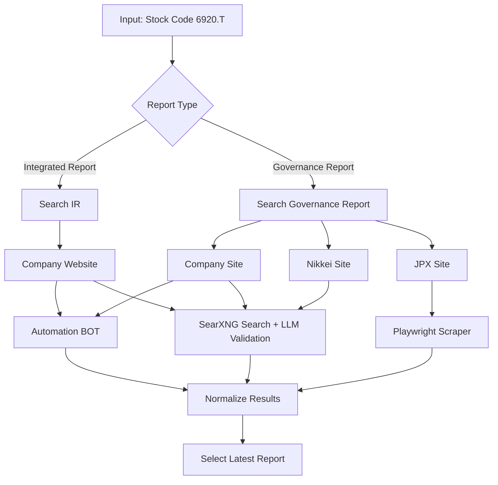
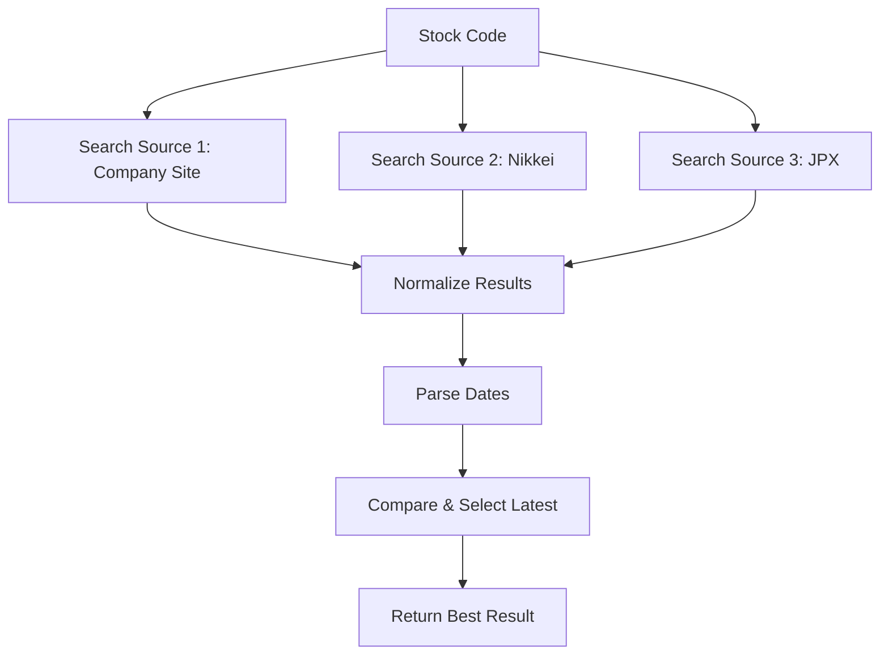
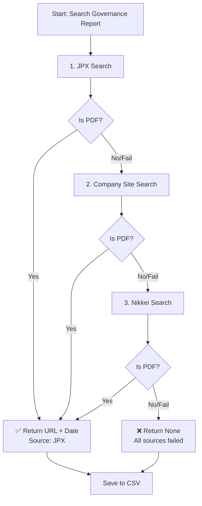
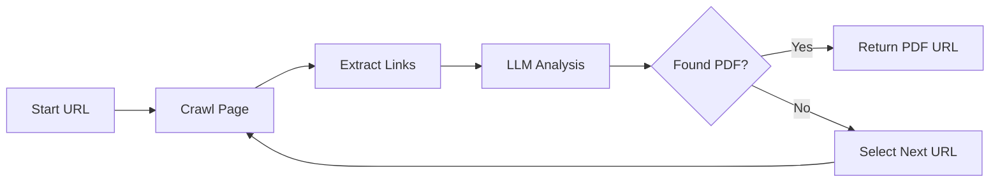

# Stock Report Search System

Hệ thống tự động tìm kiếm các báo cáo tài chính (Integrated Reports & Corporate Governance Reports) từ nhiều nguồn khác nhau cho các công ty niêm yết trên sàn chứng khoán Nhật Bản.

## 📋 Tổng Quan



## 🎯 Chức Năng Chính

### 1️⃣ **Search On Company Site**
Tìm kiếm báo cáo trực tiếp trên website của công ty

**Input:**
- Stock code (e.g., `"6920.T"`)
- Search keyword (e.g., `"integrated report"`, `"corporate governance report"`)

**Steps:**
1. Fetch company name & website từ yfinance
2. Tạo search query: `site:{domain} {keyword} filetype:pdf`
3. Gọi SearXNG để tìm kiếm
4. Sử dụng LLM validate và filter kết quả tốt nhất
5. Extract date & URL từ best result

**Output:**
```json
{
  "url": "https://example.com/report.pdf",
  "detected_date": "2024-05-15"
}
```

**Functions:**
- `on_company_site_search()` - Search 1 stock code
- `on_company_site_search_save_evaluate()` - Search & save danh sách

**Files:** `search_on_company_site.py`

---

### 2️⃣ **Search On Nikkei**
Tìm kiếm báo cáo từ Nikkei TDNET database

**Input:**
- Stock code (e.g., `"6920.T"`)
- Company name (e.g., `"Lasertec Corporation"`)

**Steps:**
1. Fetch company name từ yfinance
2. Tạo search query: `site:www.nikkei.com/markets/ir/irftp/data/tdnr/tdnetg3 CORPORATE GOVERNANCE {company_name} filetype:pdf`
3. Gọi SearXNG để tìm kiếm
4. Sử dụng LLM validate và filter kết quả tốt nhất
5. Extract date & URL từ best result

**Output:**
```json
{
  "url": "https://www.nikkei.com/markets/.../report.pdf",
  "detected_date": "2024-03-20"
}
```

**Functions:**
- `nikkei_governance_search()` - Search 1 stock code
- `nikkei_governance_search_save_evaluate()` - Search & save danh sách

**Files:** `search_on_nikkei.py`

---

### 3️⃣ **Search On JPX**
Tìm kiếm báo cáo từ Japan Exchange Group database (Playwright Scraper)

**Input:**
- Stock code (e.g., `"6920.T"`)

**Steps:**
1. Launch Playwright browser
2. Navigate tới JPX website: `https://www2.jpx.co.jp/tseHpFront/JJK020030Action.do`
3. Input stock code vào search form
4. Click "Search" button
5. Click "Basic information" button
6. Click "Corporate governance" tab
7. Extract Japanese governance table
8. Parse PDF link & date từ table rows
9. Return latest entry

**Output:**
```json
{
  "date": "2024/05/15",
  "pdf_url": "https://www2.jpx.co.jp/...report.pdf"
}
```

**Classes & Methods:**
- `JPXGovernanceScraper` class
  - `get_latest_governance(stock_code)` - Get latest governance PDF for 1 stock
  - `_search_stock()` - Step 3-4
  - `_open_basic_information()` - Step 5
  - `_open_governance_tab()` - Step 6
  - `_get_japanese_governance_table()` - Step 7
  - `_extract_latest_row()` - Step 8-9

**Functions:**
- `jpx_governance_search_save_evaluate()` - Search & save danh sách

**Files:** `search_on_jpx.py`

---

### 4️⃣ **Search Combine**
Kết hợp kết quả từ 3 nguồn, chọn báo cáo mới nhất

**Flow:**


**Key Features:**
- Tự động fetch thông tin từ yfinance
- So sánh ngày tháng từ các nguồn
- Chọn báo cáo mới nhất

**Files:** `search_combine.py`

---

### 5️⃣ **Search Fallback**
Tìm kiếm báo cáo với chiến lược fallback: JPX → Company Site → Nikkei

**Flow:**


**Chiến lược:**
1. **Ưu tiên JPX** - Tìm trên JPX trước (date chính xác nhất)
2. **Fallback Company Site** - Nếu JPX fail/not PDF, thử Company Site
3. **Fallback Nikkei** - Nếu Company Site fail/not PDF, thử Nikkei
4. **Kết quả None** - Nếu tất cả fail, return None

**Key Features:**
- ✅ Tự động fetch info từ yfinance
- ✅ Kiểm tra PDF validation (chỉ nhận file .pdf)
- ✅ Capture date publication của report
- ✅ Lưu kết quả ngay lập tức (append mode)
- ✅ Xử lý lỗi gracefully

**Output CSV columns:**
- `stock_code` - Mã chứng chỉ (e.g., "6920.T")
- `company_name` - Tên công ty
- `url` - PDF URL
- `source` - Nguồn tìm được ('jpx', 'company_site', 'nikkei')
- `report_date` - Ngày publication của report
- `success` - True/False
- `error_message` - Thông báo lỗi (nếu có)

**Functions:**
- `search_governance_fallback()` - Search 1 stock code
- `search_governance_fallback_batch()` - Search & save danh sách

**Files:** `search_governance_fallback.py`

---

### 6️⃣ **Automation Bot**
Bot tự động duyệt web tìm báo cáo bằng LLM

**Flow:**


**Tính năng:**
- LLM phân tích links
- Tự động theo dõi cycle (không lặp lại URLs)
- Max iterations = 5 để tránh vô hạn loop
- Validation PDF trước khi return

**Files:** `automation_bot.py`

---


